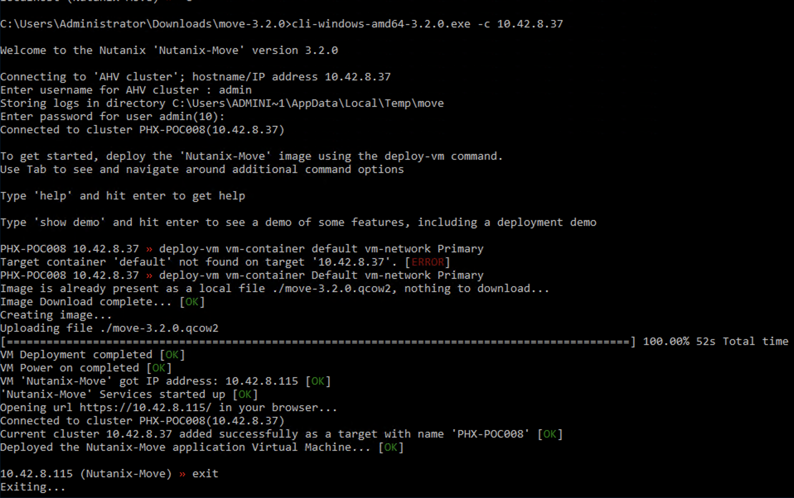

.. _move:

----------------
Nutanix Move
----------------

Overview
++++++++

Nutanix Move helps streamline ‘lift-and-shift’ virtual machine (VM) migrations to a Nutanix Enterprise Cloud.

- Streamlined migrations with one-click simplicity
- Near-zero downtime with full cutover control
- Simple test migrations and roll-back capabilities
- Cost efficient - included with all Nutanix software editions

Virtual Machine Migrations
--------------------------
Adopting new infrastructure platforms often requires a migration of pre-existing systems.
Nutanix Move simplifies bulk migration of existing VMs to Nutanix, eliminating the friction associated with onboarding new IT infrastructure. Businesses can quickly leverage the full potential of Nutanix Enterprise Cloud with near-zero VM downtime during the migration from vSphere ESXi, Hyper-V and Amazon AWS to Nutanix AHV and vSphere ESXi to ESXi on Nutanix.

In this exercise you will move an existing Windows VM, which resides on a dedicated ESXi cluster, to your AHV cluster.

.. note::
  The below text is one of the ways to install Nutanix Move onto a AHV cluster. This information can be found at `https://portal.nutanix.com/#/page/docs/details?targetId=Nutanix-Move-v32:Nutanix-Move-v32` (you need to login to the support portal). Please JUST READ the text. Nothing has to be done as we already have done some parts for you ;)...

After downloading the `ZIP <http://download.nutanix.com/move/3.2.0/move-3.2.0.zip>`_ file extract the file and run the corresponding binary according to your O/S. The following steps show the way with a Windows O/S.

1. Open a Commandline with Administrative rights.
2. CD to the location where the extracted files are.
3. Run the command

  .. code-block:: bash

    cli-windows-amd64-xxx.exe -c <AHV-CLUSTERIP>

4. Login using the username **admin** and password **miniGTS19@CE** (which has been provided to you earlier)
5. Run the command

  .. code-block:: bash

    deploy-vm vm-container INITIALS-Container vm-network Primary

  .. note::
    The command is CASE SENSITIVE!!! Make sure you use the right cases when typing the command.

The below screenshot shows the command ran on a Windows O/S.

Personalise your VM
-------------------

Now your are going to create your personal Move VM.

1. Login to the vCenter using a browser:

  - **IP Address:** 10.42.7.40
  - **Username:** administrator@vsphere.local
  - **Password:** techX2019!

2. Create a file in **your assigned Windows VM** using:

  - The Console from within the vCenter (this need an extra piece of software to be installed)
  - RDP into the VM using the IP address you found in the VM settings

3. Put some personal information in the file that makes it yours.
4. Save the file on the desktop of your VM.

Deploy your Move VM
-------------------

This module will be that you are going to deploy your own Move VM so you can use it personally to move a VM from the vCenter Cluster at **10.42.7.40** to your **AHV cluster**

1. Open your assigned AHV cluster's PRISM interface
2. Login as the **admin** user and **miniGTS19@CE** as the password.
3. Create a new VM with the following parameters:

  - **Name:** - *Initials-MOVE*
  - **vCPU:** - 2
  - **Cores:** - 2
  - **Memory:** - 4GiB
  - **Remove the CD**
  - **Add Disk:** - Clone from Images Services, use the Move-3.2.qcow2 as the original.
  - **Network Adapter:** - Primary and define **NO** IP Address

4. After hitting the **Save** button you should see something like the below screenshot.

  .. figure:: images/1.png

5. Start you Move VM and wait till you see the IP Address appear like the below screenshot.

  .. figure:: images/2.png

6. Open de browser and navigate to the IP address the VM has received. This will generate a warning about a SSL certificate. Accept the warning and open de page.
7. Accept the EULA and click on **Next**.
8. Accept the Nutanix CEP by clicking the **OK** button.
9. Provide a password like **nutanix//4u** and click the **Set Password** button
10. Login into Move using the password you just provided
11. Click the **Continue** button to proceed
12. Your browser should now roughly show the following

    .. figure:: images/10.png

Configure Move
--------------

1. Now we need to add a vCenter environment. Click on the left hand side of the screen on **+ Add Source** and provide the following parameters:

  - **Source Environment Type:** - VMware ESXi
  - **Source Name:** - vCenter-Central Cluster
  - **vCenter Server or standalone ESX host:** - 10.42.7.40
  - **User Name:** - administrator@vsphere.local
  - **Password:** - techX2019!

2. Click the **Add** button to have the MOVE vm check the connection. This might take a few seconds.

    .. figure:: images/12.png

3. If everything went OK, you should see something like the below screenshot

    .. figure:: images/13.png

Migrate your VM
---------------

1. Now click on the **Create a Migration Plan** button in the main screen of your browser to start configuring the migration of your VM from the VMware environment to your AHV cluster.
2. Name the plan *Initials*-migrate-studentvm and click the **Proceed** button
3. Select the Source of your VM and select the assigned AHV cluster as the Target. Use your earlier created Storage Container *Initials-container* and click the **Next** button
4. In the next screen, select **your** StudentVM and click the blue **+** button to add the VM to the plan.

    .. figure:: images/17.png

5. Your VM should be mentioned on the right side of the browser.
6. Click the **Next** button to get to the next step
7. Leave the settings default, just provide the username and password as **administratior** and **nutanix//4u**
8. Select the **Target Network** as **Primary** and deselect **Schedule Data Seeding**

    .. figure:: images/21.png

9. Click the **Next** button
10. Check the summary and click the **Save and Start** button to start the migration process
11. To see the progress, click on the **In Progress** blue text to see detailed information on the migration progress.

    .. figure:: images/24.png

12. As the VM has been detected as a Microsoft Windows VM, the migration process checks if the NGT has been installed. Reason for this is that the Windows O/S doesn't have the VirtIO drivers onboard by default. As we are "transforming" the VM to AHV, we need to have them installed or we cannot boot the VM and have no access to the disk and NIC(s) of the VM.

    .. figure:: images/28.png

13. After the drivers have been installed the data is being seeded by the Move VM to the AHV cluster. The VM at this time does not exist!!!
14. Seeding will take some time as this copies the data from the VMware environment to the AHV cluster. GRAB A COFFEE....
15. You can also follow the progress on the vCenter environment by logging into the vCenter using your browser.
16. After the data has been seeded Move will show that it is ready for the CutOver and provides an estimation of the time it will take.

    .. figure:: images/33.png

17. Check the settings of your VM:

  - Network is connected
  - There are no notes in the properties of the VM *BEFORE* the migration
  - The VM is powered-on

  .. figure:: images/34.png

  .. figure:: images/37.png

Cutover your VM
---------------

1. Select the VM Name to start the cutover and click the **Cutover** button. Click on the **Continue** button to start the process.

  .. figure:: images/36.png

2. Follow the process in the Move interface.
3. After the migration has finished you should see something like the below screenshot

  .. figure:: images/41.png

4. Now check in the vCenter UI that the VM has:

  - It's network disconnected
  - Been shutdown
  - Has a description field with notes

    .. figure:: images/44.png

5. Return to your PRISM interface -> VMs -> Table and search for your VM to get its IP Address.
6. RDP into the VM by using the earlier mentioned username and password **administrator** and **nutanix//4u** and see that your file is there that you created earlier.
